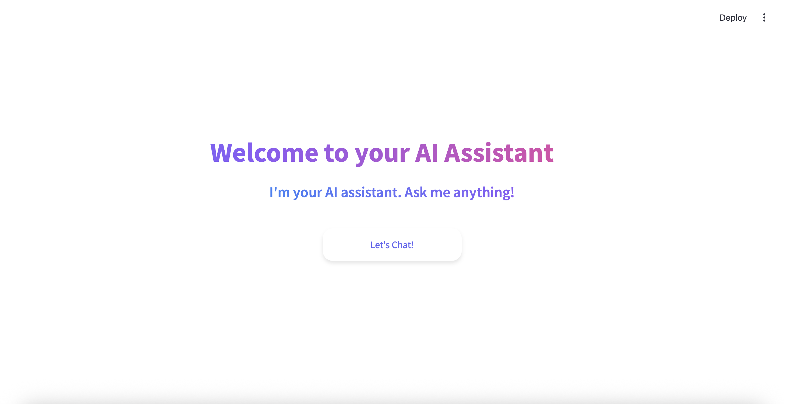
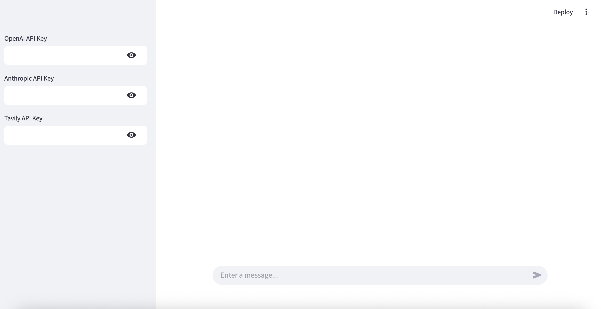
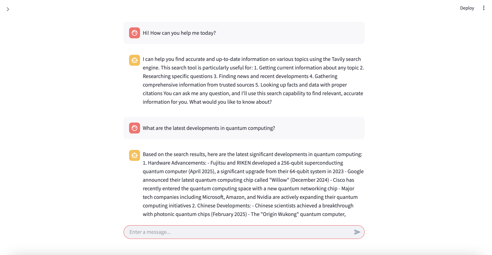

# Minimal AI Agent with LangGraph and Streamlit

A learning project exploring the capabilities of LangGraph for building AI agents and Streamlit for rapid UI development.

**Note**: Forward development of this project will continue in my other application : )

## Interface Preview

### Welcome Page

*Clean and modern welcome interface with gradient animations*

### Chat Interface
| Initial Setup | Search Capabilities |
|:-------------------:|:-------------------:|
|  |  |
| *API Key Configuration in the Sidebar* | *Demonstrating AI capabilities* |


## Currently Features

- 🤖 AI-powered chat interface using Anthropic's Claude / OpenAI model
- 🔍 Web search capabilities via Tavily Search API
- 💬 Real-time message streaming
- 🎨 Clean, responsive UI built with Streamlit

## Prerequisites

- Python 3.8+
- Anthropic API key
- Tavily Search API key

## Installation

1. Clone the repository:
```bash
git clone <repository-url>
cd <repository-name>
```

2. Install dependencies:
```bash
pip install -r requirements.txt
```

3. Set up your API keys:
   - Use your OpenAI API Key or get your Anthropic API key from [Anthropic Console](https://console.anthropic.com)
   - Get your Tavily API key from [Tavily AI](https://tavily.com)

## Usage

1. Run the Streamlit app:
```bash
streamlit run app.py
```

2. Open your browser and navigate to the provided local URL (typically http://localhost:8501)

3. Enter your API keys in the sidebar
4. Start chatting with the AI assistant!

## Important Notes

- OpenAI API or Anthropic API and Tavily Search API keys are required for the application to function
- The application uses Claude 3.5 Sonnet as the default model
- Web search functionality is powered by Tavily Search API

## Acknowledgments

- [LangGraph](https://github.com/langchain-ai/langgraph) for the agent framework
- [Streamlit](https://streamlit.io) for the UI framework
- [Anthropic](https://www.anthropic.com) for the Claude model
- [Tavily](https://tavily.com) for the search API
